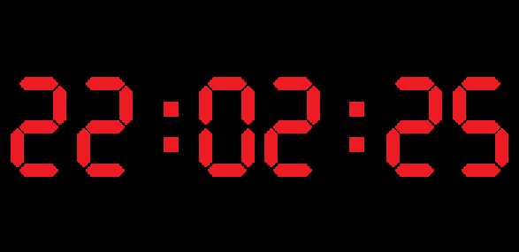

# 7-Segment Indicator
Realization of seven segment indicator with hex-decoding. There are three classes: `Segment`, `Indicator` and `Clock`.
Еhe first two classes are basic. And the last one is result. 

## Using
You must have `pygame` python library (for more information check `pygame.org`). Python3.

## Example
